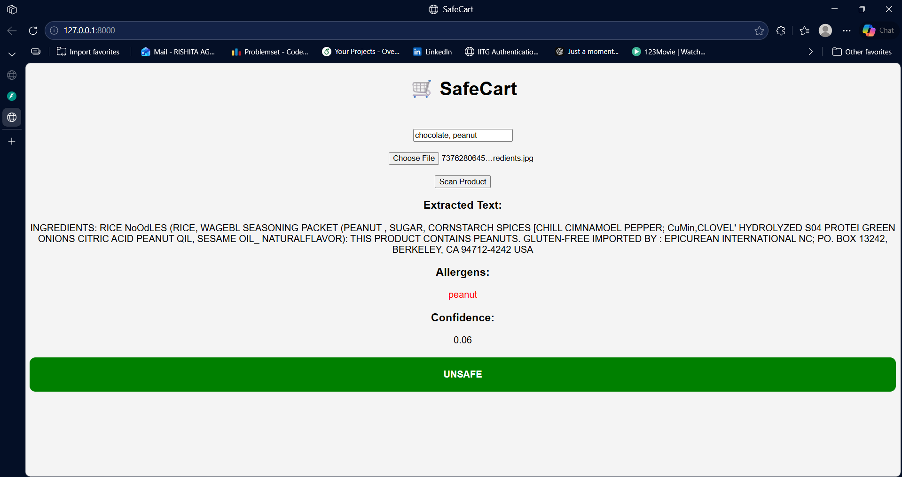

# 🛒 SafeCart – AI-Based Allergen Detection System

## 📌 Overview
SafeCart is an AI-powered system that helps users identify potential allergens in packaged food products. It uses Optical Character Recognition (OCR) and Natural Language Processing (NLP) to extract ingredient information from product images and determine whether the product is safe based on detected allergens.

---

## 🚀 Features

- 📸 **Image Upload & OCR**  
  Extracts ingredient text from product packaging using OCR.

- 🧠 **Allergen Detection (NLP)**  
  Detects common allergens like milk, gluten, soy, peanuts, etc.

- 🎯 **Personalized Allergen Filtering**  
  Users can input their own allergens and get customized results.

- 📊 **Confidence Score**  
  Indicates how confident the system is in allergen detection.

- 🎨 **Visual Safety Indicator**
  - 🟢 SAFE  
  - 🔴 UNSAFE  
  - 🟡 UNKNOWN  

- 🖥️ **Web UI Interface**  
  Simple frontend for uploading images and viewing results.

---

## 🧠 System Architecture
Image → OCR → Text Extraction → NLP → Allergen Detection → Confidence → UI Output

---

## 🖼️ Example UI



## 🛠️ Tech Stack

- **Backend:** FastAPI  
- **OCR Engine:** EasyOCR  
- **Image Processing:** OpenCV  
- **Frontend:** HTML, CSS, JavaScript  
- **Language:** Python  

---

## 📂 Project Structure
SafeCart/
│
├── app.py # Main FastAPI application
├── ocr_module.py # OCR processing (EasyOCR)
├── nlp_module.py # Allergen detection logic
├── database.py # Allergen keyword database
├── grocery.py # Safe grocery list generator
├── models.py # User profile schema
├── utils.py # Helper functions (color mapping)
│
├── templates/
│ └── index.html # UI frontend
│
├── sample_images/ # Test images
├── requirements.txt # Dependencies
└── README.md # Documentation

---

## ⚙️ Installation & Setup

### 1️⃣ Clone the repository
```bash
git clone <your-repo-link>
cd SafeCart
```

---

### 2️⃣ Install dependencies

```bash
pip install -r requirements.txt
```

---

### 3️⃣ Run the server
```bash
python -m uvicorn app:app --reload
```

---

### 4️⃣ Open in browser
http://127.0.0.1:8000

---

## 🧪 How to Use

1. Enter your allergens (e.g., `milk, peanut`)
2. Upload a product image
3. Click **Scan Product**
4. View:
   - Extracted text  
   - Detected allergens  
   - Confidence score  
   - Safety status  

---

## 📊 Example Output

```json
{
  "ocr_text": "Ingredients: sugar, milk powder, wheat flour",
  "analysis": {
    "allergens_found": ["milk", "gluten"],
    "confidence": 0.4,
    "status": "UNSAFE"
  },
  "overlay_color": "RED"
}
```

## ⚠️ Limitations

- OCR accuracy depends on image quality (blurred or low-resolution images may reduce performance)  
- Front-facing product images may not contain ingredient text, leading to incomplete analysis  
- Rule-based NLP approach may miss complex or uncommon ingredient names  
- Limited multilingual support (primarily optimized for English text)  
- No region detection (the system processes the whole image instead of focusing only on ingredient sections)  
- Confidence score is heuristic-based and not derived from a trained probabilistic model  

## 🔮 Future Improvements

- Ingredient region detection using object detection (YOLO)  
- Multilingual NLP support (XLM-R, mBERT)  
- Mobile app with AR overlay  
- Cloud-based OCR (Google Vision API)  
- Ingredient highlighting in UI  

---

## 🎤 Presentation Note

> SafeCart is a multimodal AI system combining OCR and NLP to provide real-time, personalized allergen detection from food packaging.

---

## 👩‍💻 Author

**Rishita Agarwal**  
DA627 Course Project – SafeCart  

---

## 📄 License

This project is for academic purposes.
